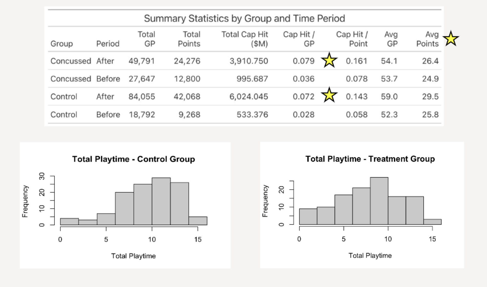

## Overview

Professional sports research frequently examines the medical impact of concussions, but less attention has been given to their financial consequences.

This project investigated whether concussions influence player value, contract efficiency, and long-term career outcomes in the NHL.

Conducted through Bentley University's Undergraduate Research Program and the Valente Center.

---

## Research Question

How does a concussion affect an NHL player's long-term market value and career trajectory?

---

## Data

Dataset included:

- 500 NHL players
- 250 players with documented concussions
- 250 matched control players

Variables included:

- Salary / Cap Hit
- Games Played
- Goals
- Assists
- Total Points
- Career Length
- Concussion timing

---

## Methodology

To isolate concussion effects:

- Used a matched-pair study design
- Matched non-concussed players with similar career histories
- Centered careers around first concussion event ("Year 0")
- Tracked trends before and after injury

---

## Key Findings
### Career Length

Concussed players averaged:

**8.3 seasons**

Control players averaged:

**10.0 seasons**

→ approximately **2 fewer NHL seasons**

---

### Contract Efficiency

Following concussion:

- Increased cost per point
- Increased cost per game played
- Smaller improvements in offensive production

---

### Salary Trends

While salaries continued increasing:

- Growth rates slowed after concussion
- Performance improvements did not keep pace with salary growth

---

## Business Implications

Findings suggest organizations may benefit from:

- Shorter contract structures
- Performance incentives
- Improved recovery planning
- Better long-term player valuation strategies

---

## Tools Used

- Python
- dplyr
- ggplot2
- Statistical Analysis
- Data Cleaning

---

<a class="btn btn-dark"
href="{{ site.baseurl }}/files/ValenteAnalysisPaper.pdf"
target="_blank">
📄 Full Paper
</a>

<a class="btn btn-dark"
href="{{ site.baseurl }}/files/ValenteFinalPresentation.pdf"
target="_blank">
📊 Presentation
</a>

